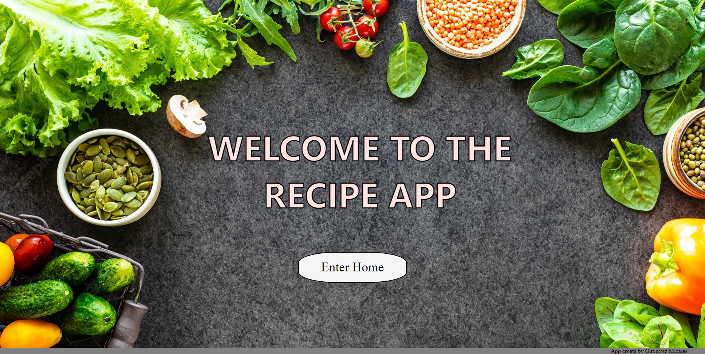
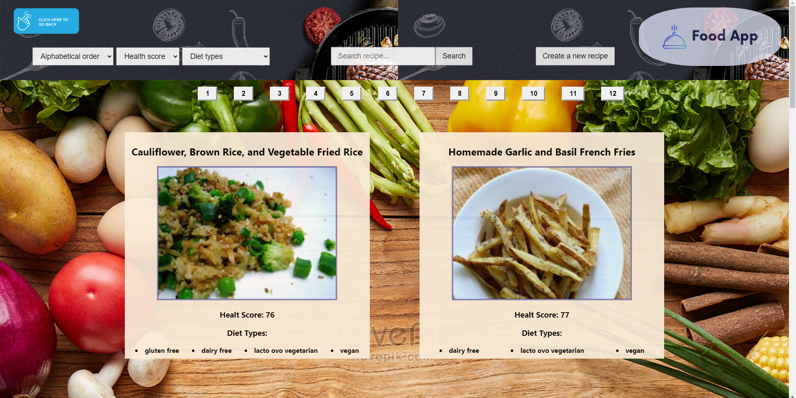
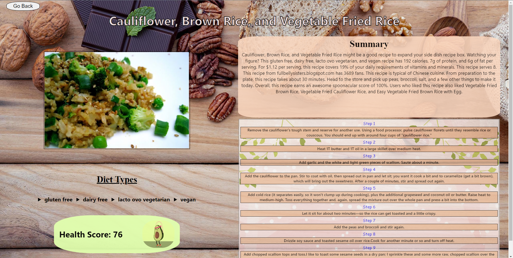
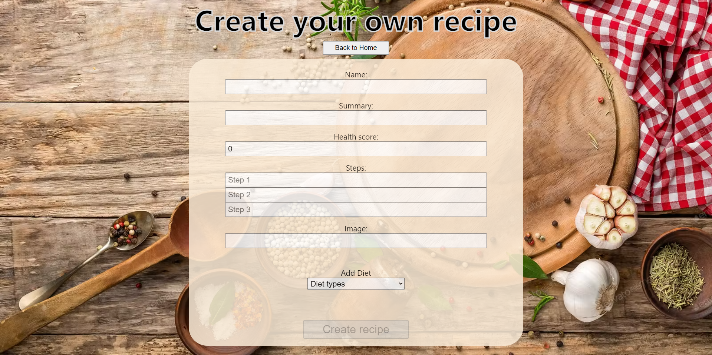

    

# Individual Project - Henry Food

  

## Objetivos del Proyecto

Proyecto temática "Food"

"Recipe App" es una SPA, que consume datos de una API externa (Spoonacular) para su funcionamiento.
En la App podemos visualizar 100 cartas de recetas paginadas, las cuales podemos filtrar por "Tipo de Dieta" y ordenar tanto alfabéticamente, como por su respectivo puntaje (Health Score). También podemos acceder al detalle de cada receta para conocer mas información.
Incluye la funcionalidad de buscar recetas por nombre, y en un formulario controlado podemos CREAR nuestras propias recetas.

Tecnologías usadas:
JavaScript, React Js, Redux, HTML, CSS, Node Js, Express, PostgresSQL, Sequelize.

## Como iniciar
1. Clonar el repositorio en su computadora
2. Tener nodejs (version >= 12.18.3), npm (version >= 6.14.16)
3. una vez posicionado en la carpeta del repositorio hacer `npm i` desde la carpeta **/client** y `npm i` desde la carpeta **/api**
4. Crear una base de datos de postgres local o en la nube, si no sabe como hacerlo puede consultar el siguiente link: [crear base de datos](http://postgresql-dbms.blogspot.com/p/crear-una-base-de-datos-en-postgres-sql.html)
5. Crear un archivo .env en la carpeta /api, este archivo sirve para determinar las variables de entorno que seran utilizadas al inciar el proyecto,
debe tener los siguientes valores contenidos en el:
~~~
DB_USER=
DB_PASSWORD=
DB_HOST=
PORT=3001
APIKEY=
~~~
donde ``DB_USER`` es el usuario de su base de datos, ``DB_PASSWORD`` es la password de su base de datos, ``DB_HOST`` es el host de su base de datos,
``PORT`` es el puerto donde se inicializa el backend del proyecto; si ya tiene este puerto ocupado puede utilizar otro. y por ultimo ``APIKEY`` debe ser proporcionada por el servicio de api de [Spooncular](https://spoonacular.com/food-api)

6. Luego que se hayan instalado todas las librerias con el paso anterior desde la carpeta **/api** ejecutar el comando `npm start` para inciar el backend del proyecto, igualmente hacer ``npm start`` en /client  para iniciarlo
7. luego de esto, abrir el navegador en http://localhost:3000 en el navegador

## Resultados 
### **Sí ha completado los pasos exitosamente en su navegador deberia visualizar una aplicacion como esta:**

### **El inicio de la pagina, donde tendra las recetas y la posibilidad de ordenar, filtrar y buscar una receta especifica**

### **El detalle de la receta**

### **Un formulario de creacion de recetas**

